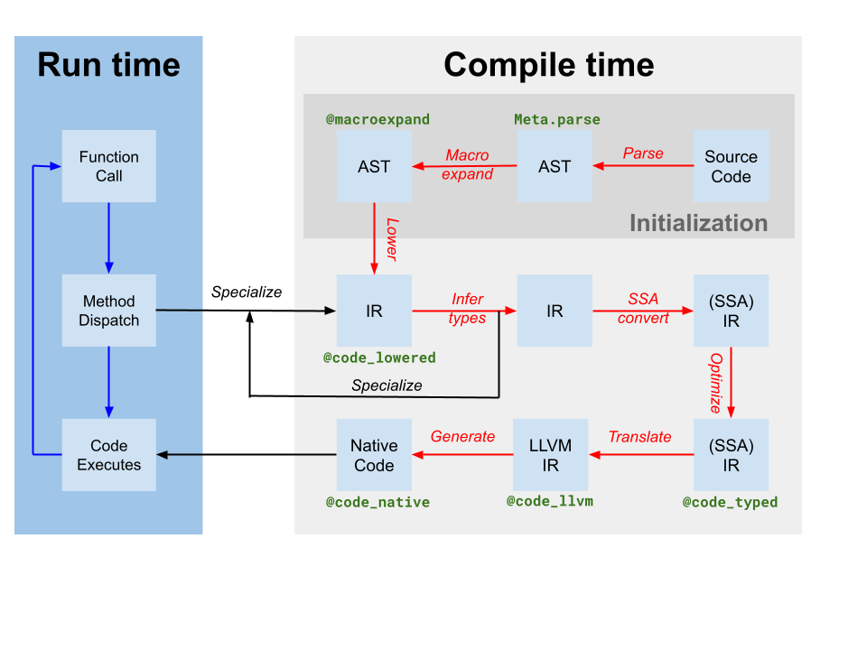

# Eval of Julia code {#Eval-of-Julia-code}

One of the hardest parts about learning how the Julia Language runs code is learning how all of the pieces work together to execute a block of code.

Each chunk of code typically makes a trip through many steps with potentially unfamiliar names, such as (in no particular order): flisp, AST, C++, LLVM, `eval`, `typeinf`, `macroexpand`, sysimg (or system image), bootstrapping, compile, parse, execute, JIT, interpret, box, unbox, intrinsic function, and primitive function, before turning into the desired result (hopefully).

::: tip Definitions
- REPL
  REPL stands for Read-Eval-Print Loop. It&#39;s just what we call the command line environment for short.
  
- AST
  Abstract Syntax Tree The AST is the digital representation of the code structure. In this form the code has been tokenized for meaning so that it is more suitable for manipulation and execution.
  

:::





## Julia Execution {#Julia-Execution}

The 10,000 foot view of the whole process is as follows:
1. The user starts `julia`.
  
2. The C function `main()` from `cli/loader_exe.c` gets called. This function processes the command line arguments, filling in the `jl_options` struct and setting the variable `ARGS`. It then initializes Julia (by calling [`julia_init` in `init.c`](https://github.com/JuliaLang/julia/blob/master/src/init.c), which may load a previously compiled [sysimg](/devdocs/eval#dev-sysimg)). Finally, it passes off control to Julia by calling [`Base._start()`](https://github.com/JuliaLang/julia/blob/master/base/client.jl).
  
3. When `_start()` takes over control, the subsequent sequence of commands depends on the command line arguments given. For example, if a filename was supplied, it will proceed to execute that file. Otherwise, it will start an interactive REPL.
  
4. Skipping the details about how the REPL interacts with the user, let&#39;s just say the program ends up with a block of code that it wants to run.
  
5. If the block of code to run is in a file, [`jl_load(char *filename)`](https://github.com/JuliaLang/julia/blob/master/src/toplevel.c) gets invoked to load the file and [parse](/devdocs/eval#dev-parsing) it. Each fragment of code is then passed to `eval` to execute.
  
6. Each fragment of code (or AST), is handed off to [`eval()`](/base/base#eval) to turn into results.
  
7. [`eval()`](/base/base#eval) takes each code fragment and tries to run it in [`jl_toplevel_eval_flex()`](https://github.com/JuliaLang/julia/blob/master/src/toplevel.c).
  
8. `jl_toplevel_eval_flex()` decides whether the code is a &quot;toplevel&quot; action (such as `using` or `module`), which would be invalid inside a function. If so, it passes off the code to the toplevel interpreter.
  
9. `jl_toplevel_eval_flex()` then [expands](/devdocs/eval#dev-macro-expansion) the code to eliminate any macros and to &quot;lower&quot; the AST to make it simpler to execute.
  
10. `jl_toplevel_eval_flex()` then uses some simple heuristics to decide whether to JIT compile the  AST or to interpret it directly.
  
11. The bulk of the work to interpret code is handled by [`eval` in `interpreter.c`](https://github.com/JuliaLang/julia/blob/master/src/interpreter.c).
  
12. If instead, the code is compiled, the bulk of the work is handled by `codegen.cpp`. Whenever a  Julia function is called for the first time with a given set of argument types, [type inference](/devdocs/eval#dev-type-inference)  will be run on that function. This information is used by the [codegen](/devdocs/eval#dev-codegen) step to generate  faster code.
  
13. Eventually, the user quits the REPL, or the end of the program is reached, and the `_start()`  method returns.
  
14. Just before exiting, `main()` calls [`jl_atexit_hook(exit_code)`](https://github.com/JuliaLang/julia/blob/master/src/init.c).  This calls `Base._atexit()` (which calls any functions registered to [`atexit()`](/base/base#Base.atexit) inside  Julia). Then it calls [`jl_gc_run_all_finalizers()`](https://github.com/JuliaLang/julia/blob/master/src/gc.c).  Finally, it gracefully cleans up all `libuv` handles and waits for them to flush and close.
  

## Parsing {#dev-parsing}

The Julia parser is a small lisp program written in femtolisp, the source-code for which is distributed inside Julia in [src/flisp](https://github.com/JuliaLang/julia/tree/master/src/flisp).

The interface functions for this are primarily defined in [`jlfrontend.scm`](https://github.com/JuliaLang/julia/blob/master/src/jlfrontend.scm). The code in [`ast.c`](https://github.com/JuliaLang/julia/blob/master/src/ast.c) handles this handoff on the Julia side.

The other relevant files at this stage are [`julia-parser.scm`](https://github.com/JuliaLang/julia/blob/master/src/julia-parser.scm), which handles tokenizing Julia code and turning it into an AST, and [`julia-syntax.scm`](https://github.com/JuliaLang/julia/blob/master/src/julia-syntax.scm), which handles transforming complex AST representations into simpler, &quot;lowered&quot; AST representations which are more suitable for analysis and execution.

If you want to test the parser without re-building Julia in its entirety, you can run the frontend on its own as follows:

```
$ cd src
$ flisp/flisp
> (load "jlfrontend.scm")
> (jl-parse-file "<filename>")
```


## Macro Expansion {#dev-macro-expansion}

When [`eval()`](/base/base#eval) encounters a macro, it expands that AST node before attempting to evaluate the expression. Macro expansion involves a handoff from [`eval()`](/base/base#eval) (in Julia), to the parser function `jl_macroexpand()` (written in `flisp`) to the Julia macro itself (written in - what else - Julia) via `fl_invoke_julia_macro()`, and back.

Typically, macro expansion is invoked as a first step during a call to [`Meta.lower()`](/base/base#Base.Meta.lower)/`jl_expand()`, although it can also be invoked directly by a call to [`macroexpand()`](/base/base#Base.macroexpand)/`jl_macroexpand()`.

## Type Inference {#dev-type-inference}

Type inference is implemented in Julia by [`typeinf()` in `compiler/typeinfer.jl`](https://github.com/JuliaLang/julia/blob/master/base/compiler/typeinfer.jl). Type inference is the process of examining a Julia function and determining bounds for the types of each of its variables, as well as bounds on the type of the return value from the function. This enables many future optimizations, such as unboxing of known immutable values, and compile-time hoisting of various run-time operations such as computing field offsets and function pointers. Type inference may also include other steps such as constant propagation and inlining.

::: tip More Definitions
- JIT
  Just-In-Time Compilation The process of generating native-machine code into memory right when it is needed.
  
- LLVM
  Low-Level Virtual Machine (a compiler) The Julia JIT compiler is a program/library called libLLVM. Codegen in Julia refers both to the process of taking a Julia AST and turning it into LLVM instructions, and the process of LLVM optimizing that and turning it into native assembly instructions.
  
- C++
  The programming language that LLVM is implemented in, which means that codegen is also implemented in this language. The rest of Julia&#39;s library is implemented in C, in part because its smaller feature set makes it more usable as a cross-language interface layer.
  
- box
  This term is used to describe the process of taking a value and allocating a wrapper around the data that is tracked by the garbage collector (gc) and is tagged with the object&#39;s type.
  
- unbox
  The reverse of boxing a value. This operation enables more efficient manipulation of data when the type of that data is fully known at compile-time (through type inference).
  
- generic function
  A Julia function composed of multiple &quot;methods&quot; that are selected for dynamic dispatch based on the argument type-signature
  
- anonymous function or &quot;method&quot;
  A Julia function without a name and without type-dispatch capabilities
  
- primitive function
  A function implemented in C but exposed in Julia as a named function &quot;method&quot; (albeit without generic function dispatch capabilities, similar to a anonymous function)
  
- intrinsic function
  A low-level operation exposed as a function in Julia. These pseudo-functions implement operations on raw bits such as add and sign extend that cannot be expressed directly in any other way. Since they operate on bits directly, they must be compiled into a function and surrounded by a call to `Core.Intrinsics.box(T, ...)` to reassign type information to the value.
  

:::

## JIT Code Generation {#dev-codegen}

Codegen is the process of turning a Julia AST into native machine code.

The JIT environment is initialized by an early call to [`jl_init_codegen` in `codegen.cpp`](https://github.com/JuliaLang/julia/blob/master/src/codegen.cpp).

On demand, a Julia method is converted into a native function by the function `emit_function(jl_method_instance_t*)`. (note, when using the MCJIT (in LLVM v3.4+), each function must be JIT into a new module.) This function recursively calls `emit_expr()` until the entire function has been emitted.

Much of the remaining bulk of this file is devoted to various manual optimizations of specific code patterns. For example, `emit_known_call()` knows how to inline many of the primitive functions (defined in [`builtins.c`](https://github.com/JuliaLang/julia/blob/master/src/builtins.c)) for various combinations of argument types.

Other parts of codegen are handled by various helper files:
- [`debuginfo.cpp`](https://github.com/JuliaLang/julia/blob/master/src/debuginfo.cpp)
  Handles backtraces for JIT functions
  
- [`ccall.cpp`](https://github.com/JuliaLang/julia/blob/master/src/ccall.cpp)
  Handles the ccall and llvmcall FFI, along with various `abi_*.cpp` files
  
- [`intrinsics.cpp`](https://github.com/JuliaLang/julia/blob/master/src/intrinsics.cpp)
  Handles the emission of various low-level intrinsic functions
  

::: tip Bootstrapping

The process of creating a new system image is called &quot;bootstrapping&quot;.

The etymology of this word comes from the phrase &quot;pulling oneself up by the bootstraps&quot;, and refers to the idea of starting from a very limited set of available functions and definitions and ending with the creation of a full-featured environment.

:::

## System Image {#dev-sysimg}

The system image is a precompiled archive of a set of Julia files. The `sys.ji` file distributed with Julia is one such system image, generated by executing the file [`sysimg.jl`](https://github.com/JuliaLang/julia/blob/master/base/sysimg.jl), and serializing the resulting environment (including Types, Functions, Modules, and all other defined values) into a file. Therefore, it contains a frozen version of the `Main`, `Core`, and `Base` modules (and whatever else was in the environment at the end of bootstrapping). This serializer/deserializer is implemented by [`jl_save_system_image`/`jl_restore_system_image` in `staticdata.c`](https://github.com/JuliaLang/julia/blob/master/src/staticdata.c).

If there is no sysimg file (`jl_options.image_file == NULL`), this also implies that `--build` was given on the command line, so the final result should be a new sysimg file. During Julia initialization, minimal `Core` and `Main` modules are created. Then a file named `boot.jl` is evaluated from the current directory. Julia then evaluates any file given as a command line argument until it reaches the end. Finally, it saves the resulting environment to a &quot;sysimg&quot; file for use as a starting point for a future Julia run.
